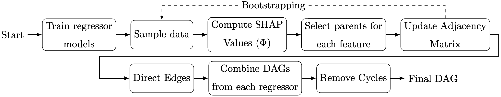

# `causalgraph` - A library to infer causal-effect relationships from tabular data

[](https://opensource.org/licenses/MIT)
[](https://www.python.org/downloads/release/python-31012/)
[](#)
[](https://github.com/renero/causalgraph/actions/workflows/codecov.yaml)
[](https://codecov.io/gh/renero/causalgraph)
[](https://renero.github.io/causalgraph/)


**`causalgraph`** is a library that implements methods to extract the causal graph,
from tabular data, specifically the **ReX** method, and other compared methods
like GES, PC, FCI, LiNGAM, CAM, and NOTEARS.

ReX is a causal discovery method that leverages machine learning (ML) models 
coupled with explainability techniques, specifically Shapley values, to 
identify and interpret significant causal relationships among variables. 
Comparative evaluations on synthetic datasets comprising tabular data reveal that 
ReX outperforms state-of-the-art causal discovery methods across diverse data 
generation processes, including non-linear and additive noise models. Moreover, 
ReX was tested on the Sachs single-cell protein-signaling dataset, achieving a 
precision of 0.952 and recovering 
key causal relationships with no incorrect edges. Taking together, these 
results showcase **ReX**’s effectiveness in accurately recovering true causal 
structures while minimizing false positive pre- dictions, its robustness 
across diverse datasets, and its applicability to real-world problems. 
By combining ML and explainability techniques with causal discovery, **ReX** 
bridges the gap between predictive modeling and causal inference, offering an 
effective tool for understanding complex causal structures.



It is built using SKLearn estimators, so that it can be used in scikit-learn 
pipelines and (hyper)parameter search, while facilitating testing (including 
some API compliance), documentation, open source development, packaging, 
and continuous integration.

The datasets used in the examples can be generated using the `generators` 
module, which is also part of this library. But in case you want to 
reproduce results from the articles that we used as reference, you can find 
the datasets in the `data` folder.

## Prerequisites without Docker

- Operating System: Linux or macOS
- Environment Manager: PyEnv or Conda
- Programming Language: Python 3.10.12 or higher
- Hardware: CPU

## Installation

In the comming days the library will be made available in PyPI. 
In the meantime, you can install it from the source code:

```bash
$ git clone
$ cd causalgraph
$ pip install .
```

## Data

The datasets used to reproduce the results presented in the manuscript are 
available under the `data` folder. The datasets were generated using the
`generators` module.

## Executing `causalgraph`

To run `causalgraph` on your data, you can use the `causalgraph` command:

```
$ python -m causalgraph
   ____                      _  ____                 _
  / ___|__ _ _   _ ___  __ _| |/ ___|_ __ __ _ _ __ | |__
 | |   / _` | | | / __|/ _` | | |  _| '__/ _` | '_ \| '_ \
 | |__| (_| | |_| \__ \ (_| | | |_| | | | (_| | |_) | | | |
  \____\__,_|\__,_|___/\__,_|_|\____|_|  \__,_| .__/|_| |_|
                                              |_|
usage: causalgraph [-h] -d DATASET [-m {rex,pc,fci,ges,lingam,cam,notears}] 
                   [-t TRUE_DAG] [-l LOAD_MODEL] [-T THRESHOLD] [-u UNION] 
                   [-i ITERATIONS] [-b BOOTSTRAP] [-r REGRESSOR] [-S SEED] 
                   [-s [SAVE_MODEL]] [-v] [-q] [-o OUTPUT]
```

that will present you with a menu to choose the dataset you want to use, the 
method you want to use to infer the causal graph, and the hyperparameters you
want to use.

The minimum required to run `causalgraph` is a dataset file in CSV format,
with the first row containing the names of the variables, and the rest of
the rows containing the values of the variables. The method selected by default
is ReX, but you can also choose between PC, FCI, GES, LiNGAM, CAM, NOTEARS. 
At the end of the execution, the edges of the plausible causal graph will be 
displayed along with the metrics obtained, if the true dag is provided 
(argument `-t`).


## Example commands

The following command illustrates how to run `causalgraph` on the Sachs dataset
using the ReX method:

```bash
$ python -m causalgraph -d /path/to/sachs.csv -t /path/to/sachs.dot
```

The same command can be used to run `causalgraph` on the Sachs dataset using the
CAM method:

```bash
$ python -m causalgraph -d /path/to/sachs.csv -m cam -t /path/to/sachs.dot
```

## Input Arguments Information

WIP

## Additional Information

WIP